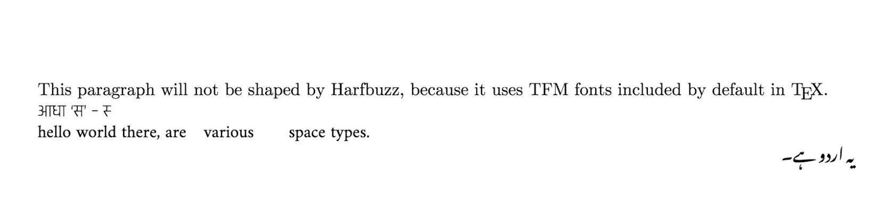

## Full BiDi text layout in LuaTeX using luaharfbuzz and luabidi
### Running the examples

_TODO_

If you encounter any issues, or have further questions, please [file an issue](https://github.com/deepakjois/luatex-harfbuzz/issues/new).

### Sample PDFs
Check the [Samples folder](./samples).

Some screenshots:

_noto_urdu.tex_

_doc.tex_

